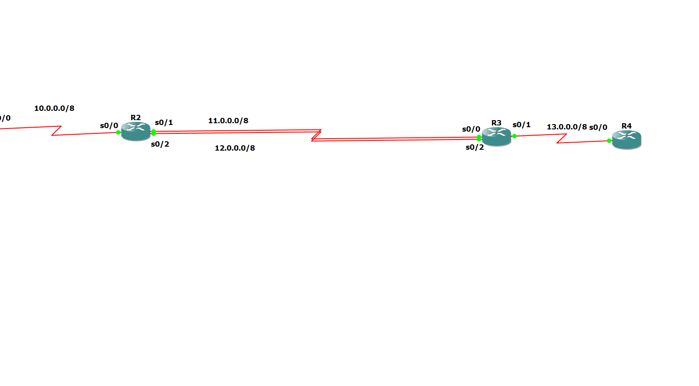

# Static Routing with Redundant Links (Dual Path Topology)

## 🎯 Aim
To configure static routing in a four-router topology with dual links between R2 and R3, and verify redundancy and end-to-end connectivity.

---

## 🛠 Tools Used
- GNS3
- Cisco IOS Routers
- Serial Interfaces

---

## 🌐 Network Topology

### Network Details

| Link | Network | Subnet Mask |
|------|----------|-------------|
| R1 – R2 | 10.0.0.0 | 255.0.0.0 |
| R2 – R3 | 11.0.0.0 | 255.0.0.0 |
| R2 – R3 | 12.0.0.0 | 255.0.0.0 |
| R3 – R4 | 13.0.0.0 | 255.0.0.0 |

R2 and R3 are connected using two separate serial links to provide redundancy.

---

## 📂 Router Configuration Files

The complete router configuration files are available in the `configs` folder:

- R1.cfg
  
- R2.cfg

- R3.cfg

- R4.cfg

---

## 🧭 Static Routing Configuration

### 🔹 On R1
Routes configured to reach all remote networks via R2:

ip route 11.0.0.0 255.0.0.0 10.0.0.2

ip route 12.0.0.0 255.0.0.0 10.0.0.2

ip route 13.0.0.0 255.0.0.0 10.0.0.2

---

### 🔹 On R2
Route to reach R4 network through R3:

ip route 13.0.0.0 255.0.0.0 11.0.0.2

(Optional backup route via alternate link)

ip route 13.0.0.0 255.0.0.0 12.0.0.2 5

---

### 🔹 On R3
Route to reach R1 network:

ip route 10.0.0.0 255.0.0.0 11.0.0.1

(Alternate path possible via 12 network)

---

### 🔹 On R4
Routes configured to reach all upstream networks:

ip route 10.0.0.0 255.0.0.0 13.0.0.1

ip route 11.0.0.0 255.0.0.0 13.0.0.1

ip route 12.0.0.0 255.0.0.0 13.0.0.1

---

## 🔄 Redundancy Concept

Two serial links (11.0.0.0 and 12.0.0.0) between R2 and R3 provide:

- Backup connectivity
- Alternate routing path
- Increased network reliability

A floating static route can be configured using higher administrative distance for backup.

---

## ✅ Verification

Commands used:

show ip route
ping 13.0.0.2

Successful end-to-end ping confirms static routing is working properly.

---

## 📌 Outcome

Static routing was successfully implemented in a dual-link topology.  
Redundant path configuration ensures improved network reliability and backup routing.

---

## 🎓 Internship

CCNA Internship – TECHBOXX  
Completed by: Furqaan Manzoor
