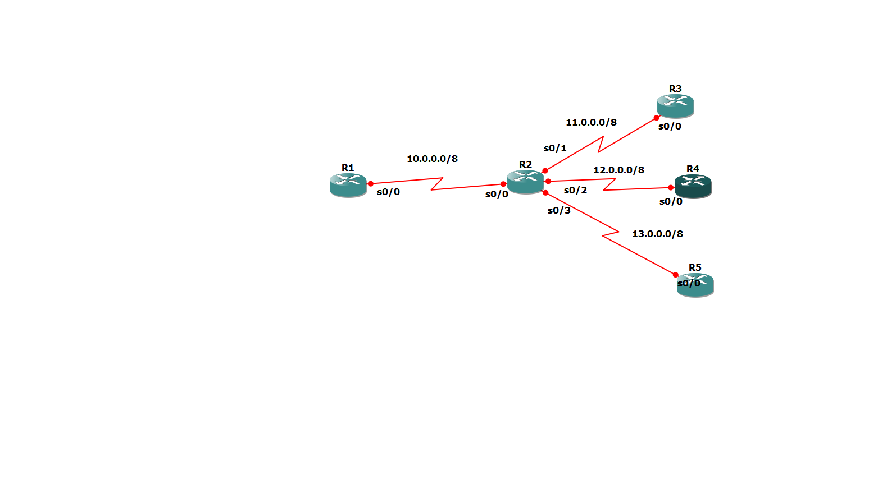

# Static Routing Configuration – Five Router Topology

## 🎯 Aim
To configure static routing in a five-router topology using GNS3 and verify end-to-end network connectivity.

---

## 🛠 Tools Used
- GNS3
- Cisco IOS Routers
- Serial Interfaces (s0/0, s0/1, s0/2, s0/3)

---

## 🌐 Network Topology

### Network Details

| Link | Network Address | Subnet Mask |
|------|-----------------|-------------|
| R1 – R2 | 10.0.0.0 | 255.0.0.0 |
| R2 – R3 | 11.0.0.0 | 255.0.0.0 |
| R2 – R4 | 12.0.0.0 | 255.0.0.0 |
| R2 – R5 | 13.0.0.0 | 255.0.0.0 |

R2 acts as the central router connecting all other routers.

---

## 📂 IP Address Configuration

### 🔹 R1

interface s0/0

ip address 10.0.0.1 255.0.0.0

no shutdown

### 🔹 R2

interface s0/0

ip address 10.0.0.2 255.0.0.0

no shutdown

interface s0/1

ip address 11.0.0.1 255.0.0.0

no shutdown

interface s0/2

ip address 12.0.0.1 255.0.0.0

no shutdown

interface s0/3

ip address 13.0.0.1 255.0.0.0

no shutdown

### 🔹 R3

interface s0/0

ip address 11.0.0.2 255.0.0.0

no shutdown

### 🔹 R4

interface s0/0

ip address 12.0.0.2 255.0.0.0

no shutdown

### 🔹 R5

interface s0/0

ip address 13.0.0.2 255.0.0.0

no shutdown

---

## 🧭 Static Routing Configuration

### 🔹 On R1

ip route 11.0.0.0 255.0.0.0 10.0.0.2

ip route 12.0.0.0 255.0.0.0 10.0.0.2

ip route 13.0.0.0 255.0.0.0 10.0.0.2

### 🔹 On R3

ip route 10.0.0.0 255.0.0.0 11.0.0.1

ip route 12.0.0.0 255.0.0.0 11.0.0.1

ip route 13.0.0.0 255.0.0.0 11.0.0.1

### 🔹 On R4

ip route 10.0.0.0 255.0.0.0 12.0.0.1

ip route 11.0.0.0 255.0.0.0 12.0.0.1

ip route 13.0.0.0 255.0.0.0 12.0.0.1

### 🔹 On R5

ip route 10.0.0.0 255.0.0.0 13.0.0.1

ip route 11.0.0.0 255.0.0.0 13.0.0.1

ip route 12.0.0.0 255.0.0.0 13.0.0.1

R2 does not require static routes because it is directly connected to all networks.

---

## ✅ Verification

- Used `show ip route` to verify routing table entries.
- Successfully pinged from R1 to R5.
- End-to-end connectivity established.

Example:

R1# ping 13.0.0.2
!!!!!
Success rate is 100 percent

---

## 📌 Outcome

All five routers were successfully interconnected using static routing.  
Proper routing table configuration allowed full communication between all networks.

---

## 🎓 Internship

CCNA Internship – TECHBOXX  
Completed by: Furqaan Manzoor
