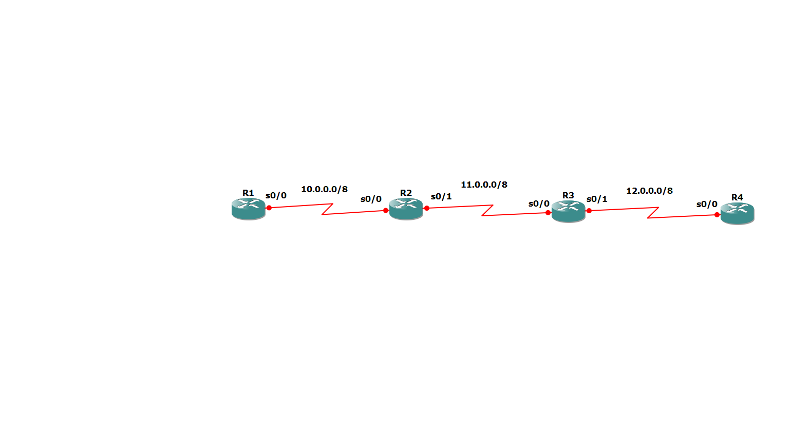

# Static Routing Configuration – Four Router Linear Topology

## 🎯 Aim
To configure static routing in a four-router linear topology using GNS3 and verify end-to-end connectivity between all routers.

## 🛠 Tools Used
- GNS3
- Cisco IOS Routers
- Serial Interfaces (s0/0, s0/1)

## 🌐 Network Topology

### Network Details

| Link | Network Address | Subnet Mask |
|------|-----------------|-------------|
| R1 – R2 | 10.0.0.0 | 255.0.0.0 |
| R2 – R3 | 11.0.0.0 | 255.0.0.0 |
| R3 – R4 | 12.0.0.0 | 255.0.0.0 |

The routers are connected in a linear chain:

R1 → R2 → R3 → R4

## 📂 IP Address Configuration

### 🔹 R1

interface s0/0

ip address 10.0.0.1 255.0.0.0

no shutdown

### 🔹 R2

interface s0/0

ip address 10.0.0.2 255.0.0.0

no shutdown

interface s0/1

ip address 11.0.0.1 255.0.0.0 

no shutdown

### 🔹 R3

interface s0/0

ip address 11.0.0.2 255.0.0.0

no shutdown

interface s0/1

ip address 12.0.0.1 255.0.0.0

no shutdown

### 🔹 R4

interface s0/0

ip address 12.0.0.2 255.0.0.0

no shutdown

## 🧭 Static Routing Configuration

Each router must be manually configured to reach remote networks.

### 🔹 On R1

ip route 11.0.0.0 255.0.0.0 10.0.0.2

ip route 12.0.0.0 255.0.0.0 10.0.0.2

### 🔹 On R2

ip route 12.0.0.0 255.0.0.0 11.0.0.2

### 🔹 On R3

ip route 10.0.0.0 255.0.0.0 11.0.0.1

### 🔹 On R4

ip route 10.0.0.0 255.0.0.0 12.0.0.1

ip route 11.0.0.0 255.0.0.0 12.0.0.1

## 💾 Save Configuration

On each router:

copy running-config startup-config

or

wr

## ✅ Verification

- Used `show ip route` to verify routing table entries.
- Successfully pinged from R1 to R4.
- End-to-end connectivity established.

Example:

R1# ping 12.0.0.2
!!!!!
Success rate is 100 percent

## 📌 Outcome

All four routers were successfully interconnected using static routing.  
Manual route configuration enabled communication between non-directly connected networks.

---

## 🎓 Internship

CCNA Internship – TECHBOXX  
Completed by: Furqaan Manzoor
