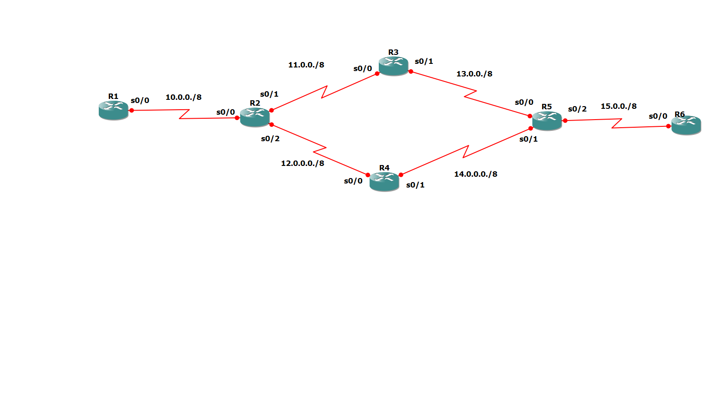

# Static Routing with Administrative Distance (Floating Static Route)
## Six-Router Redundant Topology – CCNA Practical

---

## 🎯 Aim

To configure static routing in a six-router topology with redundant paths and implement floating static routes using Administrative Distance (AD) to provide automatic failover.

---

## 🛠 Tools Used

- GNS3
- Cisco IOS Routers
- Serial Interfaces
- CLI Configuration

---

## 🌐 Network Topology

### Network Details

| Link | Network Address | Subnet Mask |
|------|------------------|-------------|
| R1 – R2 | 10.0.0.0 | 255.0.0.0 |
| R2 – R3 | 11.0.0.0 | 255.0.0.0 |
| R2 – R4 | 12.0.0.0 | 255.0.0.0 |
| R3 – R5 | 13.0.0.0 | 255.0.0.0 |
| R4 – R5 | 14.0.0.0 | 255.0.0.0 |
| R5 – R6 | 15.0.0.0 | 255.0.0.0 |

---

## 🏗 Topology Description

This topology provides:

- Primary path:  
  R1 → R2 → R3 → R5 → R6  

- Backup path:  
  R2 → R4 → R5  

Dual paths between R2 and R5 improve reliability and ensure network redundancy.

---

## 📂 Router Configuration Files

All complete router configuration files are available in the `configs` folder:

- R1.cfg
- R2.cfg
- R3.cfg
- R4.cfg
- R5.cfg
- R6.cfg

---

## 🧭 Static Routing Configuration

### 🔹 Primary Static Route (Default AD = 1)

On R2 (towards R6 network):

ip route 15.0.0.0 255.0.0.0 11.0.0.2

On R5 (towards R1 network):

ip route 10.0.0.0 255.0.0.0 13.0.0.1

These routes use the upper path (R3 link) as the primary path.

---

### 🔹 Floating Static Route (Backup Route)

On R2 (backup via R4):

ip route 15.0.0.0 255.0.0.0 12.0.0.2 17

On R5 (backup via R4):

ip route 10.0.0.0 255.0.0.0 14.0.0.1 17

Here:

- AD = 1 → Primary route
- AD = 5 → Backup route
- Backup route activates only if primary link fails

---

## 💡 Administrative Distance (AD) Concept

Administrative Distance is used to determine the trustworthiness of routing information.

- Static Route Default AD = 1
- Lower AD = Higher priority
- Higher AD = Backup route

Floating static route is a static route configured with a higher AD so that it acts as a failover mechanism.

---

## 🔍 Verification Commands

Check routing table:

show ip route

Test connectivity:

ping 15.0.0.2

---

## 🔄 Failover Testing Procedure

1. Ping from R1 to R6.
2. Shutdown primary link (R2–R3):

interface s0/1
shutdown

3. Check routing table again.
4. Observe that router switches automatically to backup route via R4.

This confirms floating static routing is working successfully.

---

## ✅ Outcome

- Static routing successfully implemented.
- Redundant paths configured.
- Administrative Distance used to create floating static route.
- Automatic failover achieved.
- End-to-end connectivity verified.

---

## 📚 Learning Outcomes

This lab demonstrates:

✔ Static Routing  
✔ Multi-hop communication  
✔ Redundant network design  
✔ Administrative Distance  
✔ Floating Static Route  
✔ Failover mechanism  

---

## 🎓 Internship Details

CCNA Internship – TECHBOXX  
Practical: Static Routing with AD (Floating Static Route)  
Completed by: Furqaan Manzoor
